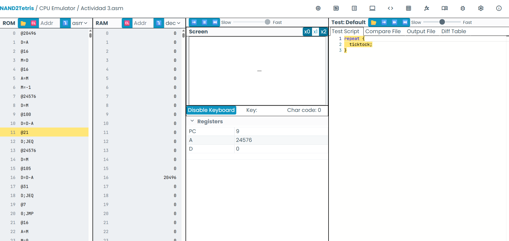

##Pseudocodigo
pintar los 16 bits de la posición dicha
@20496=-1
(Keyboard)
se presiona una tecla y se guarda en una posición de memoria (registro D)
ahora
if(D=105)
pasas al apartado (Derecha)
if(D=100)
pasas al apartado (Izquierda)
if(D=0)
Pasas al apartado (Keyboard)
(Derecha)
RAM[20496]=0//BORRAMOS LO PINTADO
RAM[20497]-1//PINTAMOS ESA DIRECCION DE PANTALLA

(Izquierda)
RAM[20496]=0//BORRAMOS LO PINTADO
RAM[20495]=-1//PINTAMOS ESA DIRECCION DE PANTALLA

lenguaje ensamblador (use chatgpt para ayudarme con el codigo )
```.asm
// Inicializar i = SCREEN
@20496
D=A
@i
M=D

// Dibujar línea inicial
@i
A=M
M=-1

// Bucle principal
(LOOP)
    @KBD
    D=M          // Leer teclado

    @100         // 'd'
    D=D-A
    @RIGHT
    D;JEQ

    @105         // 'i'
    D=D-A
    @LEFT
    D;JEQ

    @LOOP
    0;JMP

// Mover a la derecha
(RIGHT)
    @i
    A=M
    M=0          // borrar línea

    @i
    M=M+1        // i++

    @i
    A=M
    M=-1         // dibujar línea

    @LOOP
    0;JMP

// Mover a la izquierda
(LEFT)
    @i
    A=M
    M=0          // borrar línea

    @i
    M=M-1        // i--

    @i
    A=M
    M=-1         // dibujar línea

    @LOOP
    0;JMP
```
en lenguaje C#
```.asm
using System; 
// Permite usar funcionalidades básicas como leer el teclado con Console

class Program
{
    static void Main()
    {
        int[] RAM = new int[32768];
        // Simula la memoria RAM del computador Hack (32K direcciones)

        const int SCREEN = 16384;
        // Dirección donde empieza la memoria de la pantalla en Hack

        int i = SCREEN;
        // Variable que guarda la dirección del word de pantalla
        // donde está dibujada la línea (empieza en la esquina superior izquierda)

        RAM[i] = -1;
        // Dibuja la línea horizontal inicial:
        // -1 en binario es 1111111111111111 (16 pixeles negros)

        while (true)
        {
            char key = Console.ReadKey(true).KeyChar;
            // Lee una tecla del teclado (equivalente a leer KBD en Hack)

            RAM[i] = 0;
            // Borra la línea actual poniendo todos los pixeles en blanco

            if (key == 'd')
            {
                i++;
                // Mueve la línea a la derecha (siguiente word de pantalla)
            }
            else if (key == 'i')
            {
                i--;
                // Mueve la línea a la izquierda (word anterior)
            }

            RAM[i] = -1;
            // Dibuja la línea nuevamente en la nueva posición
        }
    }
}
```
 (funciona)
