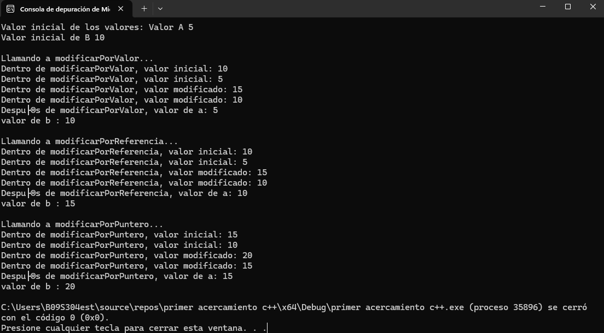

Codigo documentado del ejercicio original:
```.asm
#include <iostream>
using namespace std;

// Función que modifica el parámetro pasado por valor
void modificarPorValor(int n) {
	cout << "Dentro de modificarPorValor, valor inicial: " << n << endl;
	/*-**Parámetro * *: la función recibe n por valor.Esto significa que se hace una copia del valor de la variable que se pasa desde `main()`.
	- **Efecto * *: las modificaciones que se realizan en n dentro de la función no afectan a la variable original, ya que se trabaja sobre una copia.
		- **Salida * *: dentro de la función se imprimen dos mensajes : uno antes y otro después de sumar 5 a n.Sin embargo, fuera de la función, la variable original permanece igual.*/
	n += 5;
	cout << "Dentro de modificarPorValor, valor modificado: " << n << endl;
}

// Función que modifica el parámetro pasado por referencia
void modificarPorReferencia(int& n) {
	cout << "Dentro de modificarPorReferencia, valor inicial: " << n << endl;
	/*-Parámetro: se declara `int & n`, lo que significa que n es una referencia a la variable original.
	-Efecto: la variable `n` en la función es un alias de la variable pasada.Cualquier cambio realizado en `n` afecta directamente a la variable original.
		- Salida: la suma de 5 a `n` dentro de la función modifica la variable original, y esto se refleja fuera de la función.*/
	n += 5;
	cout << "Dentro de modificarPorReferencia, valor modificado: " << n << endl;
}

// Función que modifica el parámetro utilizando punteros
void modificarPorPuntero(int* n) {
	cout << "Dentro de modificarPorPuntero, valor inicial: " << *n << endl;
	/*-Parámetro: la función recibe un puntero `int * n`, que contiene la dirección de memoria de una variable.
		- Acceso al Valor : para acceder y modificar el valor apuntado, se utiliza el operador de indirección(`*`).
			- Efecto: al modificar `*n`, se está cambiando el valor de la variable original a la que apunta el puntero.
			- Salida: al igual que en el caso de la referencia, el cambio(suma de 5) afecta directamente a la variable original.*/
	*n += 5;
	cout << "Dentro de modificarPorPuntero, valor modificado: " << *n << endl;
}

int main() {
	int a = 10;    int b = 10;    int c = 10;
	cout << "Valor inicial de a (paso por valor): " << a << endl;    cout << "Valor inicial de b (paso por referencia): " << b << endl;    cout << "Valor inicial de c (paso por puntero): " << c << endl;
	cout << "\nLlamando a modificarPorValor(a)..." << endl;    modificarPorValor(a);    cout << "Después de modificarPorValor, valor de a: " << a << endl;
	cout << "\nLlamando a modificarPorReferencia(b)..." << endl;    modificarPorReferencia(b);    cout << "Después de modificarPorReferencia, valor de b: " << b << endl;
	cout << "\nLlamando a modificarPorPuntero(&c)..." << endl;    modificarPorPuntero(&c);    cout << "Después de modificarPorPuntero, valor de c: " << c << endl;
	return 0;
}

```
Codigo hecho segun la actividad
```.asm
#include <iostream>
using namespace std;

// Función que modifica el parámetro pasado por valor
void swapPorValor(int b, int a) {
	cout << "Dentro de modificarPorValor, valor inicial: " << a << endl;
	cout << "Dentro de modificarPorValor, valor inicial: " << b << endl;
	a += 5;
	b += 5;
	cout << "Dentro de modificarPorValor, valor modificado: " << a << endl;
	cout << "Dentro de modificarPorValor, valor modificado: " << b << endl;
}

// Función que modifica el parámetro pasado por referencia
void swapPorReferencia(int& b, int& a) {
	cout << "Dentro de modificarPorReferencia, valor inicial: " << a << endl;
	cout << "Dentro de modificarPorReferencia, valor inicial: " << b << endl;
	a += 5;
	b += 5;
	cout << "Dentro de modificarPorReferencia, valor modificado: " << a << endl;
	cout << "Dentro de modificarPorReferencia, valor modificado: " << b << endl;
}

// Función que modifica el parámetro utilizando punteros
void swapPorPuntero(int* b, int* a) {
	cout << "Dentro de modificarPorPuntero, valor inicial: " << *a << endl;
	cout << "Dentro de modificarPorPuntero, valor inicial: " << *b << endl;
	*a += 5;
	*b += 5;
	cout << "Dentro de modificarPorPuntero, valor modificado: " << *a << endl;
	cout << "Dentro de modificarPorPuntero, valor modificado: " << *b << endl;
}

int main() {
	int a = 5;    int b = 10;   
	cout << "Valor inicial de los valores: Valor A " << a << endl;    cout << "Valor inicial de B " << b << endl;   
	cout << "\nLlamando a modificarPorValor..." << endl;   swapPorValor(a,b);    cout << "Después de modificarPorValor, valor de a: " << a << endl; cout << "valor de b : " << b << endl;
	cout << "\nLlamando a modificarPorReferencia..." << endl;   swapPorReferencia(a,b);    cout << "Después de modificarPorReferencia, valor de a: " << a << endl; cout << "valor de b : " << b << endl;
	cout << "\nLlamando a modificarPorPuntero..." << endl;    swapPorPuntero(&a, &b);    cout << "Después de modificarPorPuntero, valor de a: " << a << endl; cout << "valor de b : " << b << endl;
	return 0;
}

```
