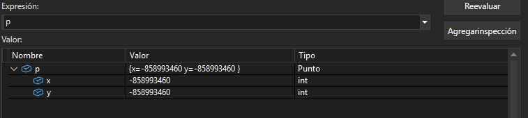
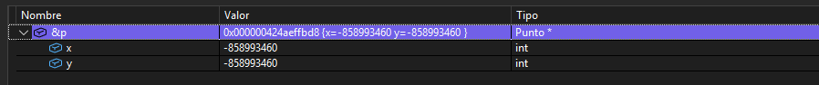

## Preguntas
### ¿cual es la diferencia entre un constructor y un destructor en C ++?
el constructor inicializa las variables del objeto mientras el destructor destruye el objeto liberando memoria
### ¿Cuál es la diferencia entre un objeto y una clase en C++?
clase: plantilla o molde que define atributos y caracteristicas
el objeto ya es una instancia que ocupa memoria y tiene valores
### ¿Qué diferencia notas entre el objeto Punto en C++ y C#?
en C++ es el objeto  se almacena en la pila stack y se destruye al salir del bloque
en C# p no es el objeto si no una referencia y se crea en  ya que se utiliza el "new punto"
el recolector de basura decide cuando destruirlo
### ¿Qué es p en C++ y qué es p en C#? (en uno de ellos p es un objeto y en el otro es una referencia a un objeto).
C++ objeto directamente
C# una referencia a un objeto

### ¿En qué parte de memoria se almacena p en C++ y en C#?
C++ como se dijo se almacena en pila stack y se destruye al salir de mani()
C# P que es la referencia se alamcena en stack mas el objeto punto esta en heap al usar new punto
y el destructor no se ejecuta al terminar el Main()

### ¿Qué observaste con el depurador acerca de p? 
Al depurar en C++ : se ven directamente los valores de x,y y se pueden ver las direcciones de memoria
p contiene directamente los datos

 Al iniciar:
 Constructor: Punto(10, 20) creado.
Punto(10, 20)
Destructor: Punto(10, 20) destruido.

break point en C ++

dirección de memoria

Al depurar en C# :
p apunta a una direccion de memoria el objeto esta en heap y como se dijo p es una referencia

Constructor: Punto(10, 20) creado.
Punto(10, 20)
### Según lo que observaste ¿Qué es un objeto en C++?
Una región de memoria que contiene directamente los datos y métodos definidos por una clase.
tiene su propia direccion tiene sus atributos internamente se destruye automaticamente si es local y no necesita new para existir (Heap)

