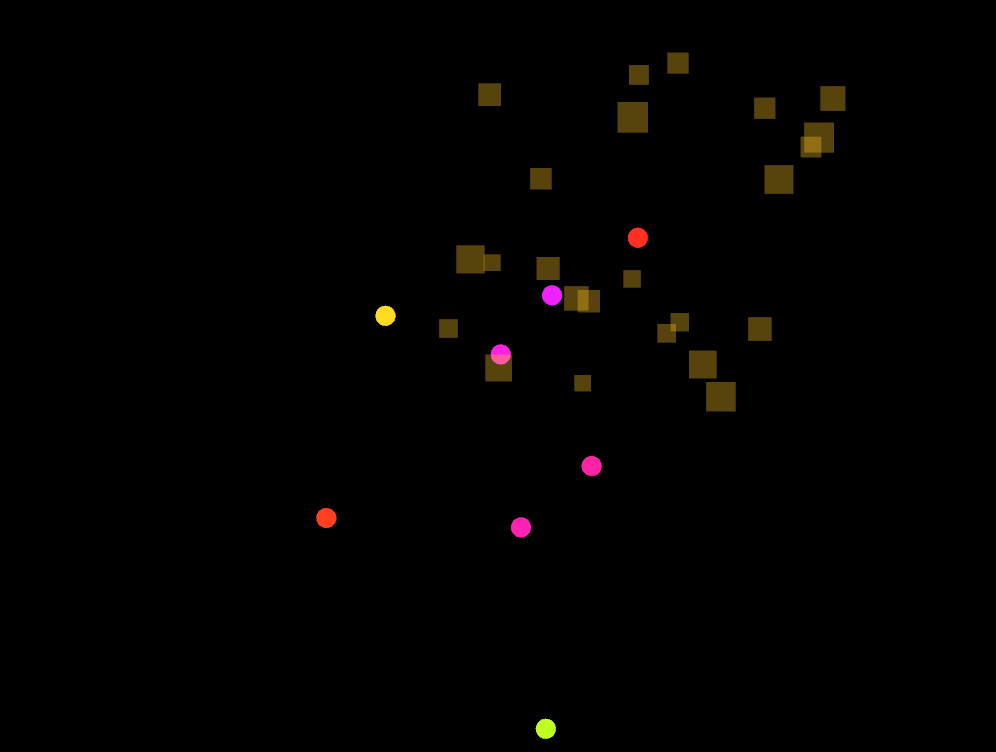

## Explicacion en mis propias palabras 
cada pelota sigue un objetivo asignado con una posicion aleatoria en la pantalla en los ejes (x,y) superiores y luego al llegar a una altura  que se encuentra en un rango particular, tiene 3 opciones de particulas de explosion cuadradas estrellas, y circulares y se decide de forma aleatoria. y luego se elimina el objeto pelota. 
### evidencia
