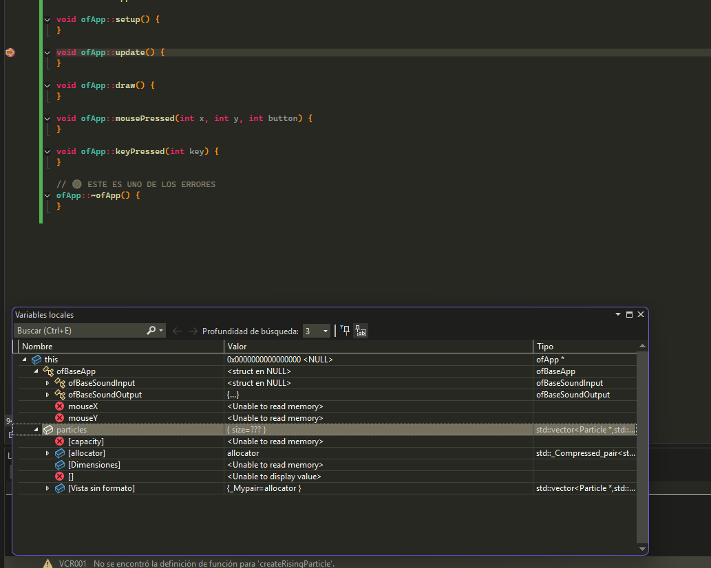
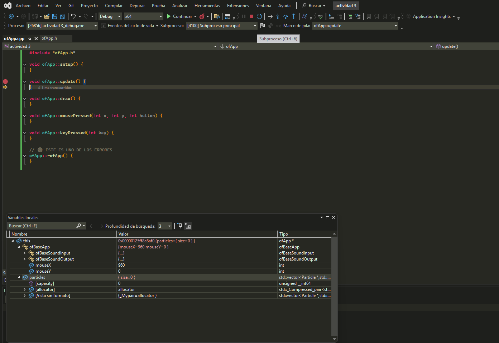
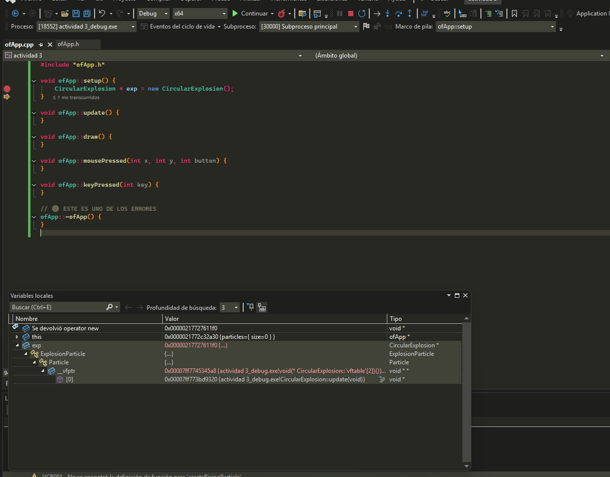
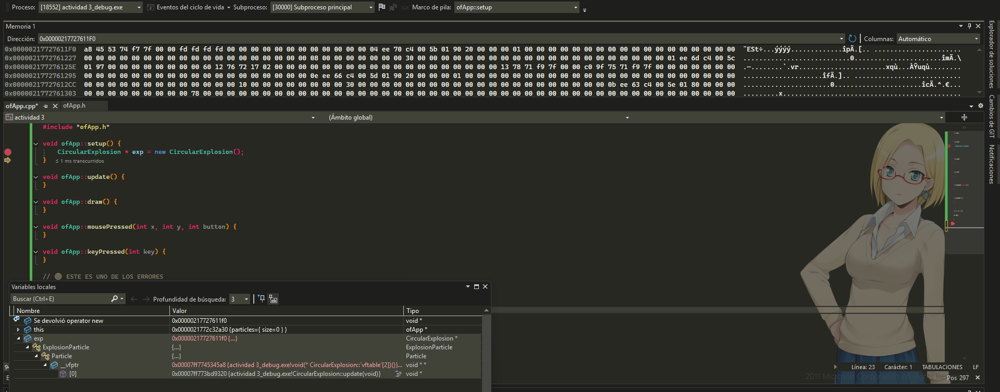
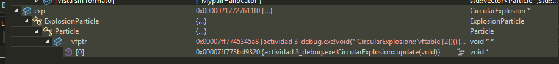

# Actividad 3
Antes de ejecutar el experimento, ¿Qué esperas ver en memoria (hipótesis)? Ejecuta el código y muestra una captura de pantalla del objeto en la memoria. ¿Qué puedes observar? ¿Qué información te proporciona el depurador? ¿Qué puedes concluir?

creo que vere que la clase se guarda en memoria stack o se hereda en otra parte del codigo (no se)

## Captura 

inicializada

se observa la direccion de memoria y of app es un puntero al objeto

ademas de la información recibida del mouse en x y y

tambien se ven las variables propia del objeto como particles
hay herencia ya que 
class ofApp hereda de ofBaseApp

## Circular explosion

## Memoria 1

## Vtable

el objeto CircularExplosion no es solo una cosa, esta compuesto por varias clases dentro,
al expandirlo se ve que tiene ExplosionParticle y luego Particle

esto muestra que hay herencia porque cada nivel pertenece a una clase diferente

en memoria el objeto esta todo junto, no separado.Tambien aparece _vtable dentro de Particle

el _vtable es un puntero que contiene funciones al abrirse aparecen varias funciones del objeto

al checar las tablas (_vtable) se ve que aunque los objetos pueden ser tratados como del mismo tipo (por ejemplo Particle), cada uno tiene funciones diferentes en su tabla,
por ejemplo en el caso de CircularExplosion aparece su propia version de update y no la de la clase padre
la tabla de funciones virtuales cambia dependiendo del tipo del objeto que se crea

aunque se use una referencia de una clase padre, el objeto mantiene sus propias funciones
sirve para que el programa sepa que funcion ejecutar en tiempo de ejecucion

por ejemplo, en el caso de los animales:

aunque todos se manejan como IAnimal, cada objeto tiene su propia implementacion de HacerSonido
el programa usa la _vtable del objeto para decidir si ejecutar el sonido del perro o del gato