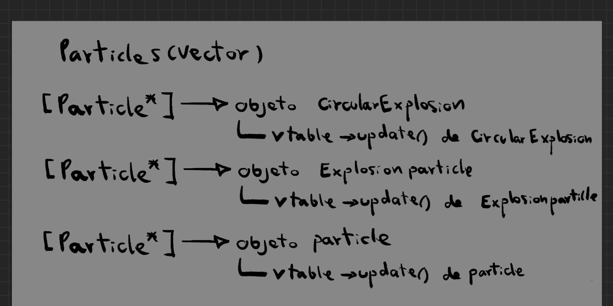

# Actividad 6

## parte 1
aunque todos los elementos del vector particles se usan como si fueran del mismo tipo (Particle), el metodo update no se comporta igual para todos
cada objeto ejectua de manera diferente su version de update se ve cuando habian diferentes tipos de particulas

## parte 2

el polimorfismo se implementa usando metodos virtuales y la _vtable

aunque se use una misma referencia, cada objeto decide que funcion ejecutar
## parte 3
los metodos virtuales permiten que exista la _vtable, cada objeto puede tener su propia version de una funcion

esto hace posible el polimorfismo, ya que un mismo metodo puede comportarse diferente dependiendo del objeto

sin metodos virtuales no habria forma de lograr esto en tiempo de ejecucion