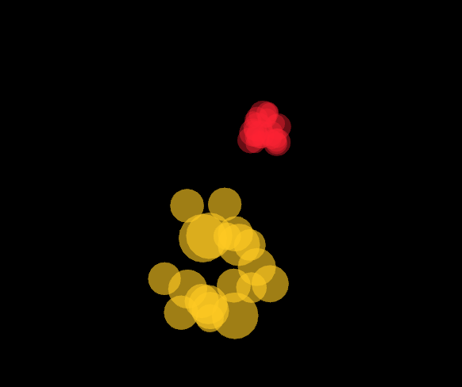

# Aplicación (Actividad #7)

(Le pedi la ayuda a la IA para hacerlo paso a paso explicandome lo que hacia en el proceso)

- A primera instancia no me parece compleja la actividad ya que por lo que puedo comprender se necesita simplemente otros dos casos de salida de particula y una explosión de particulas en el archivo ya hecho dado por el profesor.

##  ¿Cómo y por qué implementé las extensiones?

para la aplicación se crearon dos tipos de salidas de particulas las falling particles que caen desde la parte superior se mueven hacia abajo simulando gravedad y las zigzagParticles que suben  simulando el movimiento de una funcion seno  tambien se agrego una nueva tipo e explosion llamada SpiralExplosion donde las particulas giran mientras se expanden para por ultimo contraerse

opte por que fuera mas modular sin cambiar el codigo que tenia anteriormente de la actividad 2, aprovechando la herencia.

todas las particulas se heredan de la clase Particle, lo que me ayudo a reutilizar parte del codigo

todas las particulas se siguen guardadon en un vector particle sin emabrgo cada una tien su propio update() y draw

## ¿Cómo verifiqué?

Probé cada partícula usando teclas diferentes:

Presionando "f" aparecen partículas que caen


Presionando "z" aparecen en zigzag


el efecto de explosion se activa de forma aleatoria 


(Aca se puede ver la roja como tipo espiral)
El resto funciona igual que en la actividad 2

También verifiqué en el debugger que el vector contiene distintos tipos de objetos (RisingParticle, FallingParticle, etc.) pero todos como Particle*.

Esto demuestra el polimorfismo porque el mismo código funciona para diferentes tipos.

presento un error en que en caso de no poder arreglarlo me tocara solucionarlo en la clase del lunes para tomar las capturas de los breakpoints

## App.h
```C++
#pragma once
#include "ofMain.h" #include < vector>
// -------------------------------------------------
// Clase base abstracta: Particle
// -------------------------------------------------
class Particle {
public:
	virtual ~Particle() { }
	virtual void update(float dt) = 0;
	virtual void draw() = 0;
	virtual bool isDead() const = 0;
	// Nuevo método para saber si la partícula (tipo RisingParticle) debe explotar
	virtual bool shouldExplode() const { return false; }
	// Métodos para obtener posición y color, para usarlos en explosiones
	virtual glm::vec2 getPosition() const { return glm::vec2(0, 0); }
	virtual ofColor getColor() const { return ofColor(255); }
};
// -------------------------------------------------
// RisingParticle: Partícula que nace en la parte inferior central y sube
// -------------------------------------------------
class RisingParticle : public Particle {
protected:
	glm::vec2 position;
	glm::vec2 velocity;
	ofColor color;
	float lifetime;
	// tiempo máximo antes de explotar
	float age;
	bool exploded;

public:
	RisingParticle(const glm::vec2 & pos, const glm::vec2 & vel, const ofColor & col, float life)
		: position(pos)
		, velocity(vel)
		, color(col)
		, lifetime(life)
		, age(0)
		, exploded(false) { }
	void update(float dt) override {
		position += velocity * dt;
		age += dt;
		// Aumenta la desaceleración para dar sensación de recorrido largo
		velocity.y += 9.8f * dt * 8;
		// Condición de explosión: cuando la partícula alcanza aproximadamente el 15% de la altura
		float explosionThreshold = ofGetHeight() * 0.15 + ofRandom(-30, 30);
		if (position.y <= explosionThreshold || age >= lifetime) {
			exploded = true;
		}
	}
	void draw() override {
		ofSetColor(color);
		// Partícula más grande
		ofDrawCircle(position, 10);
	}
	bool isDead() const override { return exploded; }
	bool shouldExplode() const override { return exploded; }
	glm::vec2 getPosition() const override { return position; }
	ofColor getColor() const override { return color; }
};
// -------------------------------------------------
// Falling Particle: Partícula que nace en la parte superior central y baja
// -------------------------------------------------
class FallingParticle : public Particle {
protected:
	glm::vec2 position;
	glm::vec2 velocity;
	ofColor color;
	float lifetime;
	float age;

public:
	FallingParticle(const glm::vec2 & pos, const glm::vec2 & vel, const ofColor & col, float life)
		: position(pos)
		, velocity(vel)
		, color(col)
		, lifetime(life)
		, age(0) { }

	void update(float dt) override {
		position += velocity * dt;
		age += dt;
		velocity.y += 9.8f * dt * 5; // gravedad
	}

	void draw() override {
		ofSetColor(color);
		ofDrawCircle(position, 6);
	}

	bool isDead() const override {
		return age >= lifetime;
	}
};
// -------------------------------------------------
// zig zag Particle: Partícula que sube en zig zag
// -------------------------------------------------

class ZigZagParticle : public Particle {
protected:
	glm::vec2 position;
	glm::vec2 velocity;
	ofColor color;
	float age;
	float lifetime;

public:
	ZigZagParticle(const glm::vec2 & pos, const glm::vec2 & vel, const ofColor & col, float life)
		: position(pos)
		, velocity(vel)
		, color(col)
		, age(0)
		, lifetime(life) { }

	void update(float dt) override {
		age += dt;

		position.x += sin(age * 10) * 5; // zigzag
		position.y += velocity.y * dt;
	}

	void draw() override {
		ofSetColor(color);
		ofDrawCircle(position, 8);
	}

	bool isDead() const override {
		return age >= lifetime;
	}
};
// -------------------------------------------------
// Clase base para explosiones: ExplosionParticle
// -------------------------------------------------
class ExplosionParticle : public Particle {
protected:
	glm::vec2 position;
	glm::vec2 velocity;
	ofColor color;
	float age;
	float lifetime;
	float size;
	// tamaño de la partícula de explosión
public:
	ExplosionParticle(const glm::vec2 & pos, const glm::vec2 & vel, const ofColor & col, float life, float sz)
		: position(pos)
		, velocity(vel)
		, color(col)
		, age(0)
		, lifetime(life)
		, size(sz) { }
	void update(float dt) override {
		position += velocity * dt;
		age += dt;
		float alpha = ofMap(age, 0, lifetime, 255, 0, true);
		color.a = alpha;
	}
	bool isDead() const override {
		return age >= lifetime;
	}
};
// -------------------------------------------------
// CircularExplosion: Explosión en patrón circular
// -------------------------------------------------
class CircularExplosion : public ExplosionParticle {
public:
	CircularExplosion(const glm::vec2 & pos, const ofColor & col)
		: ExplosionParticle(pos, glm::vec2(0, 0), col, 1.2f, ofRandom(16, 32)) {
		float angle = ofRandom(0, TWO_PI);
		float speed = ofRandom(80, 200);
		velocity = glm::vec2(cos(angle), sin(angle)) * speed;
	}
	void draw() override {
		ofSetColor(color);
		ofDrawCircle(position, size);
	}
};
// -------------------------------------------------
// RandomExplosion: Explosión con direcciones aleatorias
// -------------------------------------------------
class RandomExplosion : public ExplosionParticle {
public:
	RandomExplosion(const glm::vec2 & pos, const ofColor & col)
		: ExplosionParticle(pos, glm::vec2(0, 0), col, 1.5f, ofRandom(16, 32)) {
		velocity = glm::vec2(ofRandom(-200, 200), ofRandom(-200, 200));
	}
	void draw() override {
		ofSetColor(color);
		ofDrawRectangle(position.x, position.y, size, size);
	}
};
// -------------------------------------------------
// StarExplosion: Explosión en forma de espiral
// -------------------------------------------------
class SpiralExplosion : public ExplosionParticle {
public:
	SpiralExplosion(const glm::vec2 & pos, const ofColor & col)
		: ExplosionParticle(pos, glm::vec2(0, 0), col, 1.5f, ofRandom(10, 20)) {

		float angle = ofRandom(0, TWO_PI);
		float speed = ofRandom(50, 150);

		velocity = glm::vec2(cos(angle), sin(angle)) * speed;
	}

	void update(float dt) override {
		ExplosionParticle::update(dt);

		// hace que gire
		float angle = atan2(velocity.y, velocity.x);
		angle += 0.1;

		float speed = glm::length(velocity);
		velocity = glm::vec2(cos(angle), sin(angle)) * speed;
	}

	void draw() override {
		ofSetColor(color);
		ofDrawCircle(position, size);
	}
};

// -------------------------------------------------
// StarExplosion: Explosión en forma de estrella
// -------------------------------------------------
class StarExplosion : public ExplosionParticle {
public:
	StarExplosion(const glm::vec2 & pos, const ofColor & col)
		: ExplosionParticle(pos, glm::vec2(0, 0), col, 1.3f, ofRandom(20, 40)) {
		float angle = ofRandom(0, TWO_PI);
		float speed = ofRandom(90, 180);
		velocity = glm::vec2(cos(angle), sin(angle)) * speed;
	}
	void draw() override {
		ofSetColor(color);
		int rays = 5;
		float outerRadius = size;
		float innerRadius = size * 0.5;
		ofPushMatrix();
		ofTranslate(position);
		for (int i = 0; i < rays; i++) {
			float theta = ofMap(i, 0, rays, 0, TWO_PI);
			float xOuter = cos(theta) * outerRadius;
			float yOuter = sin(theta) * outerRadius;
			float xInner = cos(theta + PI / rays) * innerRadius;
			float yInner = sin(theta + PI / rays) * innerRadius;
			ofDrawLine(0, 0, xOuter, yOuter);
			ofDrawLine(xOuter, yOuter, xInner, yInner);
		}
		ofPopMatrix();
	}
};
// -------------------------------------------------
// ofApp: Manejo de la escena y eventos
// -------------------------------------------------
class ofApp : public ofBaseApp {
public:
	void setup();
	void update();
	void draw();
	void mousePressed(int x, int y, int button);
	void keyPressed(int key);
	std::vector<Particle *> particles;
	~ofApp();

private:
	void createRisingParticle();
};

````

# App.cpp

```C++
#include "ofApp.h"

// --------------------------------------------------------------
void ofApp::setup() {
	ofSetFrameRate(60);
	ofBackground(0);
}

// --------------------------------------------------------------
void ofApp::update() {
	float dt = ofGetLastFrameTime();

	// Actualiza todas las partículas
	for (int i = 0; i < particles.size(); i++) {
		particles[i]->update(dt);
	}

	// Procesa las partículas
	for (int i = particles.size() - 1; i >= 0; i--) {

		if (particles[i]->shouldExplode()) {

			int explosionType = (int)ofRandom(4); // ahora hay 4 tipos
			int numParticles = (int)ofRandom(20, 30);

			for (int j = 0; j < numParticles; j++) {

				if (explosionType == 0) {
					particles.push_back(new CircularExplosion(particles[i]->getPosition(), particles[i]->getColor()));
				} else if (explosionType == 1) {
					particles.push_back(new RandomExplosion(particles[i]->getPosition(), particles[i]->getColor()));
				} else if (explosionType == 2) {
					particles.push_back(new StarExplosion(particles[i]->getPosition(), particles[i]->getColor()));
				} else {
					// NUEVA EXPLOSIÓN
					particles.push_back(new SpiralExplosion(particles[i]->getPosition(), particles[i]->getColor()));
				}
			}

			delete particles[i];
			particles.erase(particles.begin() + i);
		} else if (particles[i]->isDead()) {
			delete particles[i];
			particles.erase(particles.begin() + i);
		}
	}
}

// --------------------------------------------------------------
void ofApp::draw() {
	for (int i = 0; i < particles.size(); i++) {
		particles[i]->draw();
	}
}

// --------------------------------------------------------------
void ofApp::createRisingParticle() {

	float minX = ofGetWidth() * 0.35;
	float maxX = ofGetWidth() * 0.65;
	float spawnX = ofRandom(minX, maxX);

	glm::vec2 pos(spawnX, ofGetHeight());

	glm::vec2 target(ofGetWidth() / 2 + ofRandom(-300, 300),
		ofGetHeight() * 0.10 + ofRandom(-30, 30));

	glm::vec2 direction = glm::normalize(target - pos);
	glm::vec2 vel = direction * ofRandom(250, 350);

	ofColor col;
	col.setHsb(ofRandom(255), 220, 255);

	float lifetime = ofRandom(1.5, 3.5);

	particles.push_back(new RisingParticle(pos, vel, col, lifetime));
}

// --------------------------------------------------------------
void ofApp::mousePressed(int x, int y, int button) {
	createRisingParticle();
}

// --------------------------------------------------------------
void ofApp::keyPressed(int key) {

	// MUCHAS partículas normales
	if (key == ' ') {
		for (int i = 0; i < 1000; i++) {
			createRisingParticle();
		}
	}

	// Screenshot
	if (key == 's') {
		ofSaveScreen("screenshot_" + ofToString(ofGetFrameNum()) + ".png");
	}

	// NUEVA: FallingParticle (tecla F)
	if (key == 'f') {
		glm::vec2 pos(ofRandom(ofGetWidth()), 0);
		glm::vec2 vel(0, ofRandom(100, 200));

		ofColor col;
		col.setHsb(ofRandom(255), 255, 255);

		particles.push_back(new FallingParticle(pos, vel, col, 3.0));
	}

	// NUEVA: ZigZagParticle (tecla Z)
	if (key == 'z') {
		glm::vec2 pos(ofRandom(ofGetWidth()), ofGetHeight());
		glm::vec2 vel(0, -150);

		ofColor col;
		col.setHsb(ofRandom(255), 255, 255);

		particles.push_back(new ZigZagParticle(pos, vel, col, 3.0));
	}
}

// --------------------------------------------------------------
ofApp::~ofApp() {
	for (int i = 0; i < particles.size(); i++) {
		delete particles[i];
	}
	particles.clear();
}

```