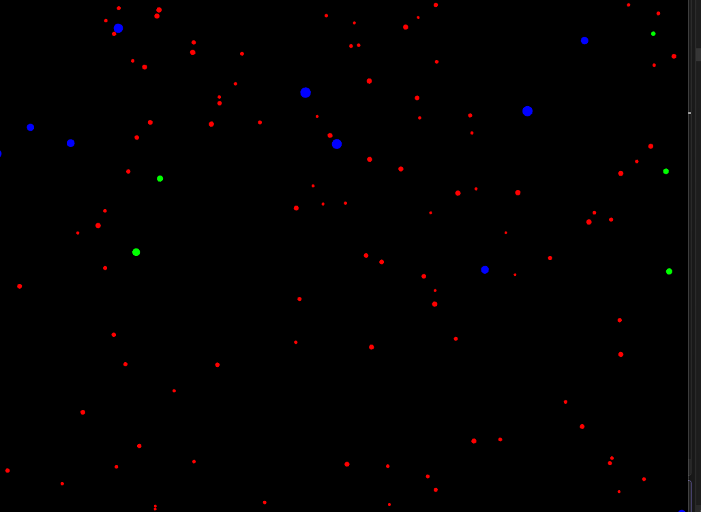
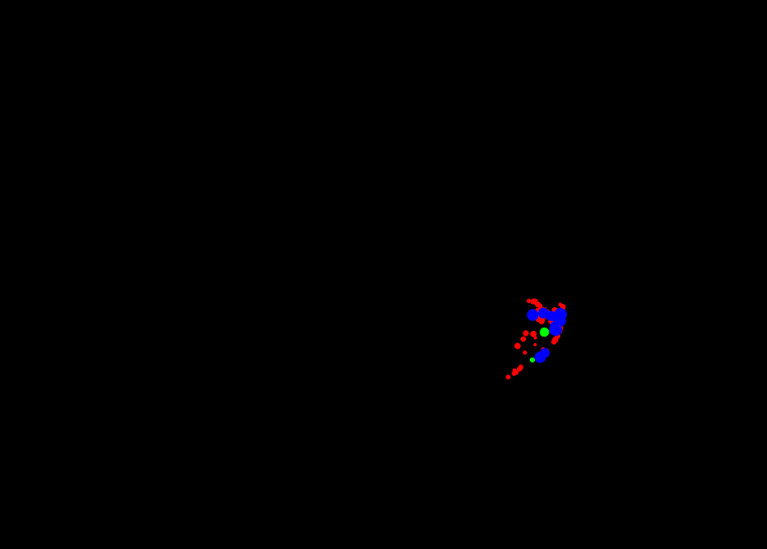
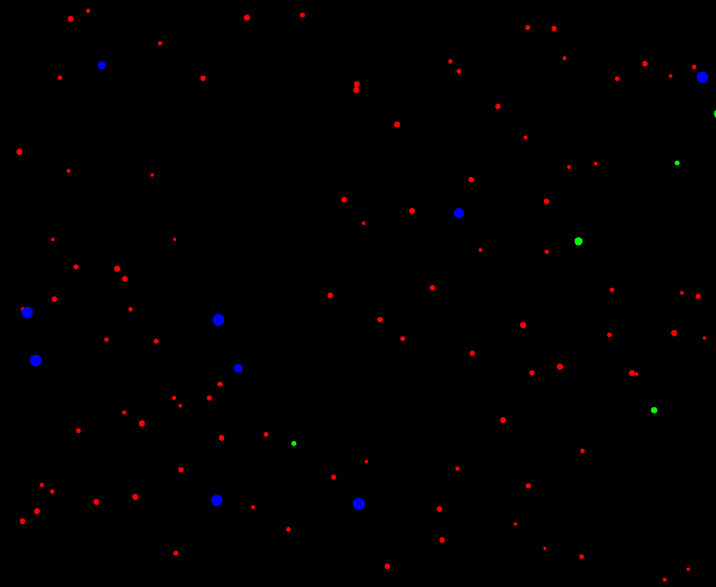
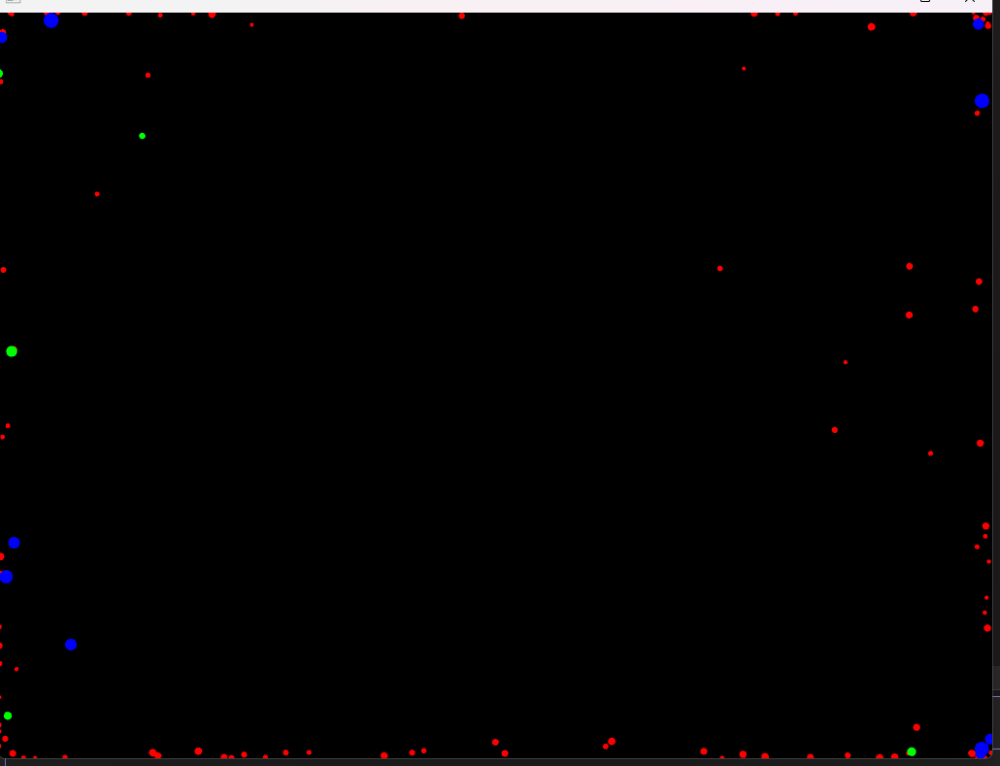
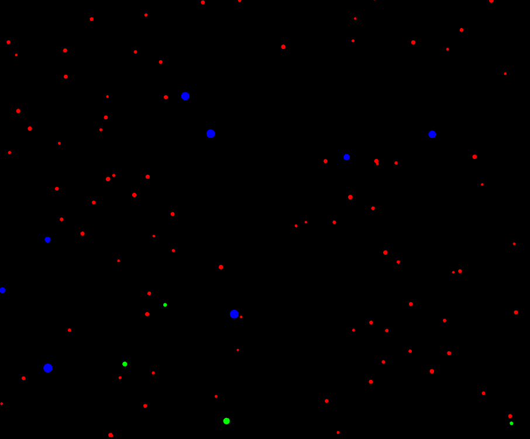
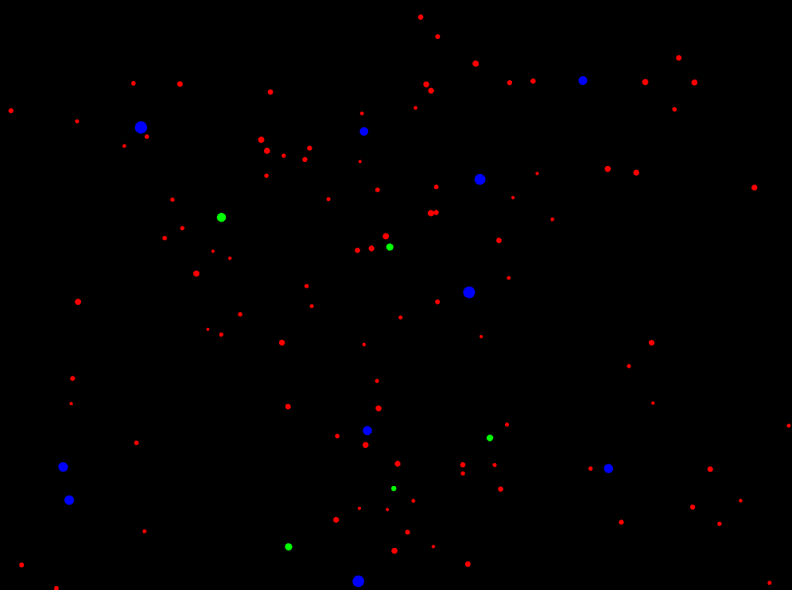
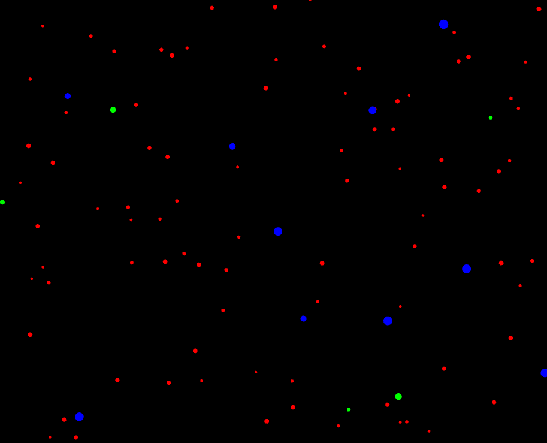
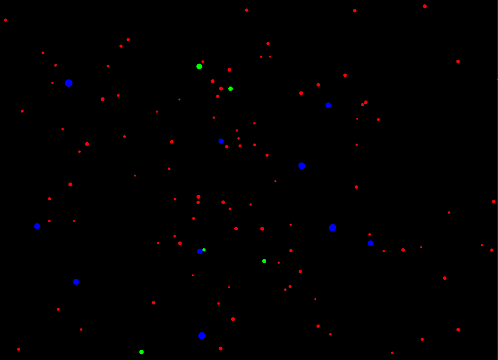

*1. ¿Cómo puedes interactuar con la aplicación? Menciona específicamente las teclas y qué efecto parecen tener sobre las partículas.*
la respuesta en la parte de capturas de pantalla

*2. ¿Observas los diferentes tipos de “partículas”? ¿Se comportan todas igual inicialmente?*
muchas particulas tiene valores aleatorios sin embargo, las particulas estrellas fugaces tienen una velocidad mayor, ademas de que cada particula tiene un color Rgb especifico
*3. Toma algunas capturas de pantalla de la aplicación en diferentes momentos (estado inicial, después de presionar ‘a’, ‘r’, ‘s’, ‘n’) y añádelas a tu bitácora.*

A 

Antes

(las particulas siguen el cursos)

R

Antes

(las particulas se repelen por donde este el cursor)

S

Antes

(las particulas se dejan de mover)
N

Antes

(las particulas siguen su comportamiento default)

*4. ¿Qué crees que está pasando “detrás de cámaras” cuando presionas las teclas? Formula una hipótesis inicial sobre cómo la aplicación cambia el comportamiento de las partículas.*
todas las particulas estan subscritas lo que hace que todas reaccion a los estados de la maquina de estados,estos estados son los que se activan con las teclas