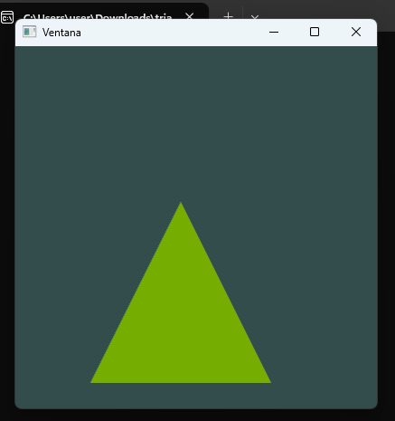
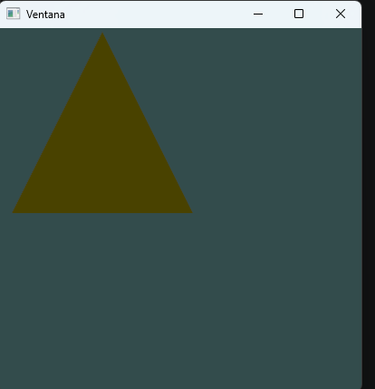

3. La posición del mouse viene en píxeles de ventana. Se normaliza dividiendo entre el ancho y alto de la ventana para obtener valores entre 0 y 1. Esto permite trabajar independientemente del tamaño de la ventana.

tipo arriba izquierda es (0,0) abajo derecha (400,400) coordenadas de computadora 
OpenGL usa otro sistema mas parecido a un plano cartesiano
izquierda es -1
centro es 0
derecha es 1

4. OpenGL no usa coordenadas en píxeles sino coordenadas NDC, que van de -1 a 1. Por eso después de normalizar el mouse entre 0 y 1, se hace otra conversión usando fórmulas como:

```
x * 2 - 1
```
y en "Y"
```
1 - y * 2
```
Con eso las coordenadas ya se normalizan para el sistema que usa OpenGL para dibujar en pantalla. Además el eje Y se invierte porque en el mouse el origen está arriba y en OpenGL el centro es 0 y arriba es positivo.